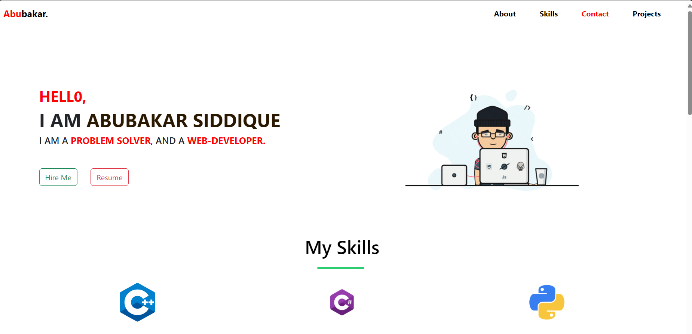
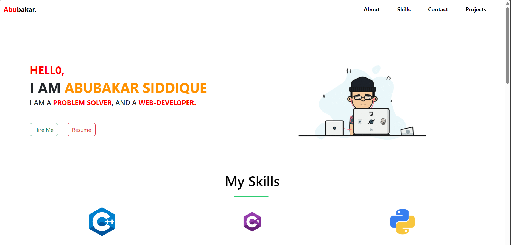
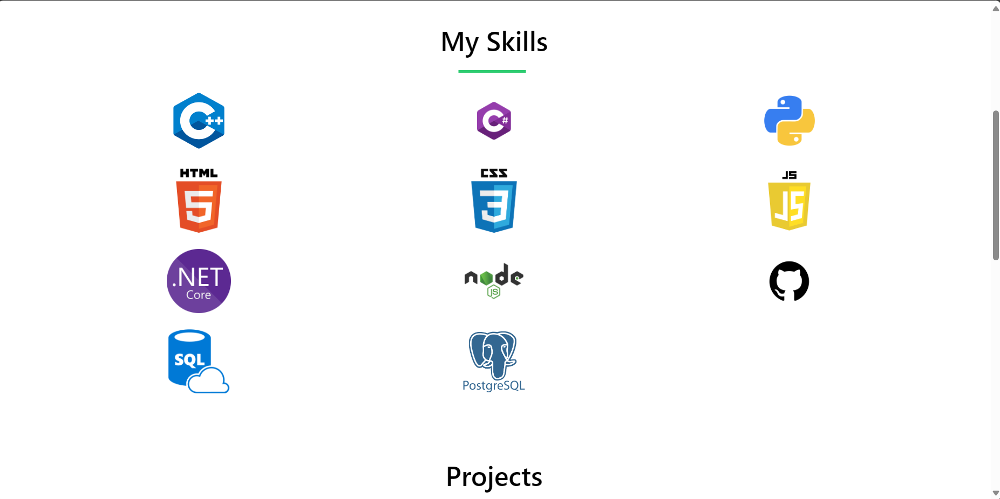
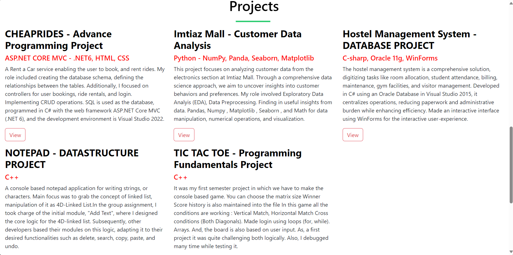
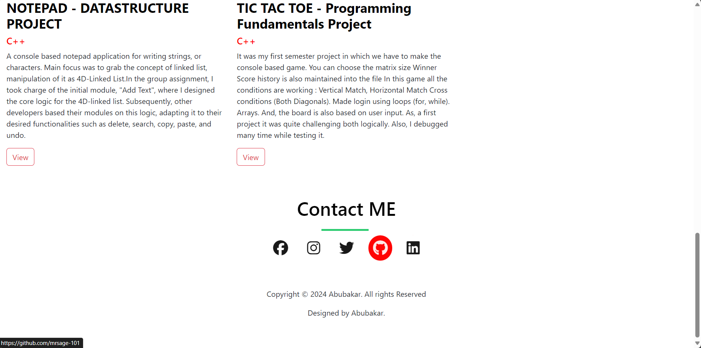
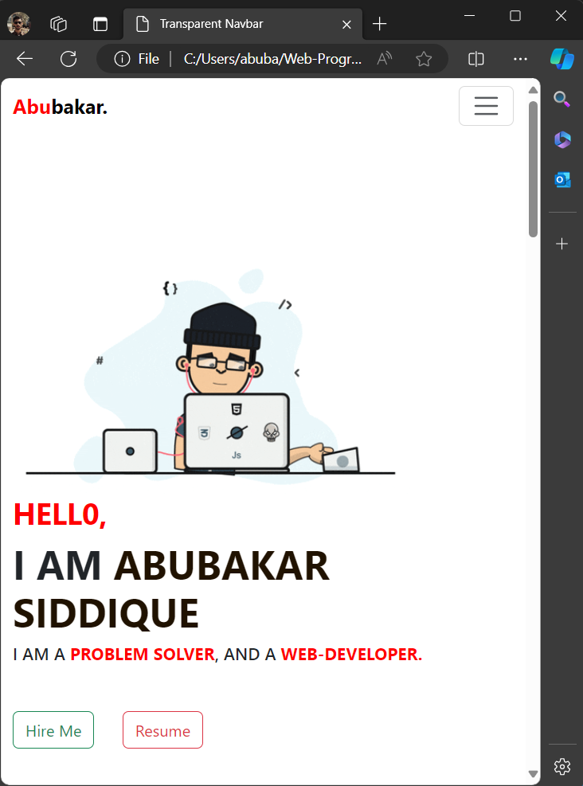
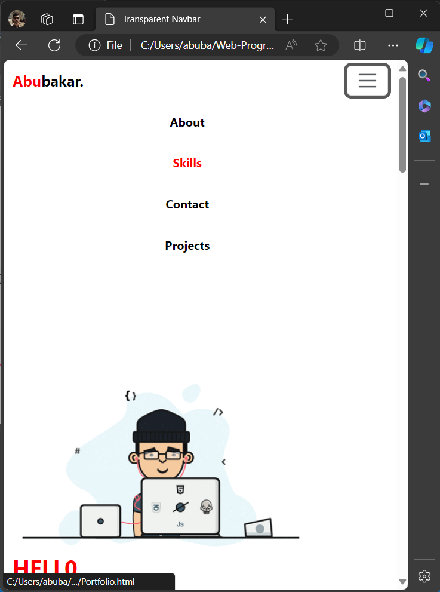
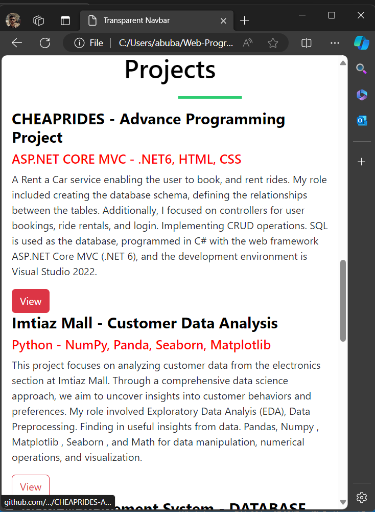
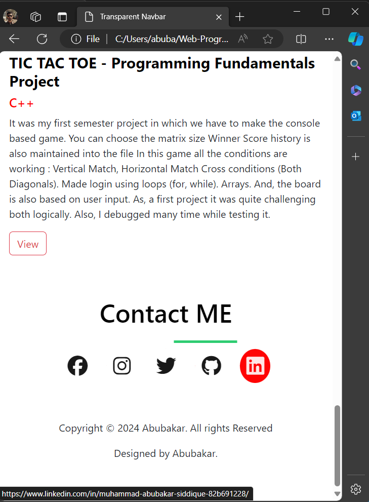

# Web-Programming
## TASK-01 (Create Responsive Porfolio)
###Deployed Link: https://mrsage-101.github.io/Web-Programming/

Used Html, CSS, and Bootstrap for making this portfolio.
 

The navbar on hover changes color, also the Abubakar Siddique is animated changing color consistently with hover.

For Skills section. I used the grid

For Projects section used Bootstrap d-flex.

For Contact Me imported icon from font awesome icon library

It is responsive portfolio single page website for all screen sizes.

 
 
 
 
 
 
 
 
 
 

### Technologies Covered:
- HTML
- CSS
- Bootstrap
- Javascript
